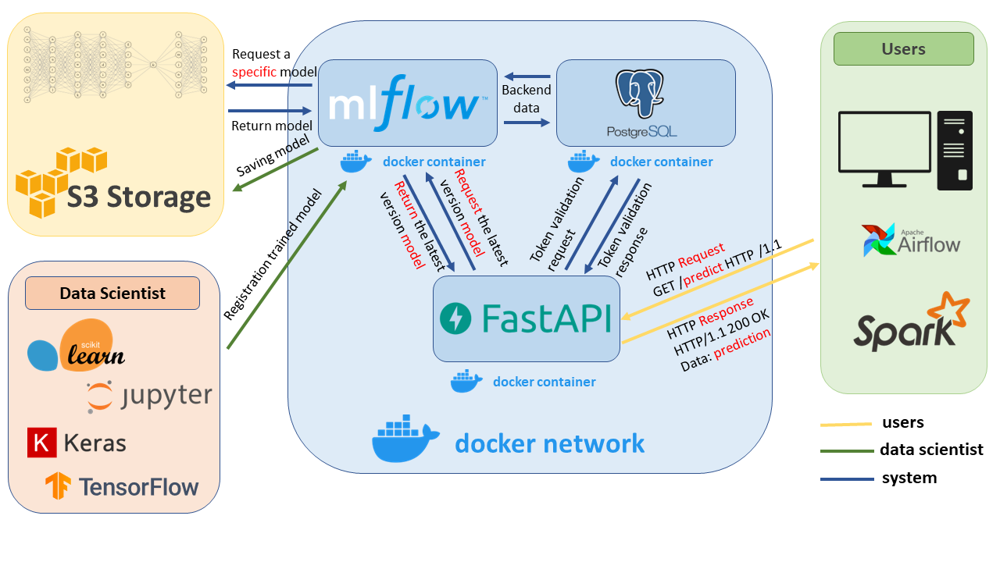

Example of deploying an API server for a ML-model using FastApi, MlFlou, Cloud Object Storage and local Postgres
==============================

Project plan:
------------
1. Running and configuring Postgres in a local docker container
2. Running and configuring MlFlow in a local docker container
3. Searching a random Jupyter Notebook with any ML-model on kaggle.com
4. Preparing the ML-model for Deployment
5. Uploading the ML-model to the Cloud Object Storage using MLFlow
6. Deployment of an API server that allows to use the ML-model in a local docker container
____

Project scheme
------------

_____

Required packages
------------
~~~
docker
docker-compose
python3.8
~~~

_____

Deployment: 
------------
0. Rename the file <example_env> to <.env> and specify the correct parameters in each directory.

1. Docker network creation
~~~
docker network create -d bridge main-network
~~~
2. Depoyment of a Postgres container in the created network
~~~
docker-compose -f postgress/docker-compose.yaml up -d
~~~
3. Creating a database and a user in Postgres for MlFlow backend.
~~~
docker exec -it postgres bash
psql -U postgres

CREATE USER mlflow_admin WITH PASSWORD 'mlflow';
CREATE DATABASE mlflow_db;
GRANT ALL PRIVILEGES ON DATABASE mlflow_db TO mlflow_admin;
~~~
4. Creating a database and a user in Postgres for API Server Access Token
~~~
CREATE USER mladmin WITH PASSWORD 'mladmin';
CREATE DATABASE mldata;
GRANT ALL PRIVILEGES ON DATABASE mldata TO mladmin;

exit
~~~
5. Creating an access token for the API Server
~~~
psql -U mladmin -d mldata

CREATE TABLE IF NOT EXISTS public.users (
    id int NOT NULL GENERATED ALWAYS AS IDENTITY PRIMARY KEY,
    "user" VARCHAR NOT NULL,
    "token" VARCHAR NOT NULL,
    "access" BOOLEAN NOT NULL
);

INSERT INTO public.users ("user","token","access")
VALUES ('user','9zM3MTx1nWfQfazsDTqsWd2VYXrhEV',true);

exit
~~~
6. Depoyment of a MLFlow container in the created docker network
~~~
docker-compose -f mlflow/docker-compose up -d
~~~
7. Searching a Jupyter Notebook, Preparing and Uploading to MLFlow the ML-model. (See it in app README.md).

8. Deployment of a API server container in the created docker network
~~~
docker-compose -f app/docker-compose.yaml up -d
~~~
9. Testing service at http://127.0.0.1:80/docs

_____

Project Organization
------------

    ├── README.md
    │
    ├── apiserver
    │   ├── README.md 
    │   ├── docker-compose.yaml
    │   ├── Dockerfile
    │   ├── entrypoint.sh
    │   ├── requirements.txt
    │   ├── example.env
    │   ├── main.py
    │   ├── app
    │   ├── tests
    │   ├── data 
    │   ├── notebooks
    │   └── models
    │ 
    ├── postgres  
    │   ├── docker-compose.yaml
    │   ├── postgres.conf 
    │   ├── example.env
    │   └── data 
    │
    ├── mlflow    
    │   ├── docker-compose.yaml
    │   ├── Dockerfile
    │   ├── entrypoint.sh
    │   ├── requirements.txt
    │   ├── example.env 
    │   └── mlruns 
    │
    └── .gitignore

------------
